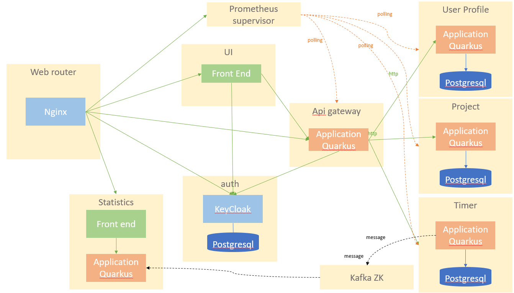

# timeflies
App for sub contractors who works for several account at the same time and who would love to measure their workload to ease creation and justification invoices. A quarkus micro service application based on soyeloso/timeflies concept. 

## Global project overview
Application that allows to track time to projects. It's about microservices communicating either synchronously via REST or asynchronously using Kafka:

- [User REST API](./rest-user/README.md): Allows CRUD operations on User which are stored in a Postgres database [](https://sonarcloud.io/dashboard?id=timounet_timeflies_rest-users) 
- [User Profile REST API](./rest-user/README.md): Allows CRUD operations on User profile which are stored in a Postgres database  [](https://sonarcloud.io/dashboard?id=timounet_timeflies_rest-users) 
- [Project REST API](./rest-project/README.md): Allows CRUD operations on Project which are stored in a Postgres database
- [Timer REST API](./rest-timer/README.md): Allows CRUD operations on Project times (to start / stop a clock timer) which are stored in a Postgres database 
- [API Gateway ](./rest-gw/README.md) This REST API invokes every micro service APIs. It implements security with keycloak 
- [Time flies UI](./ui/README.md): a reactJs application allowing you to pick up a project and play timers. The TimeFlies UI is exposed via nginx? and invokes the Gateway REST API. It will be keycloak UI either, for login, registration, forgot password ans logout
- [KeyCloak](./auth/README.md): authentication service having dedicated postgres database
- [Prometheus supervisor](./supervisor/README.md): Micro Service supervisor polling micro services health and metrics
- [Web router](./router/README.md): Nginx web router / reverse proxy / load balancer / application entry point. Will host https
- [Statistics](./event-statistics/README.md): Each timer is asynchronously sent (via Kafka) to the Statistics microservice. It has a HTML + JQuery UI displaying all the statistics.

## Development requirements
### Git
- Branch names convention : [GitFlow names](https://nvie.com/posts/a-successful-git-branching-model/)
- Feature branches : use Pull Request 
### Checking Ports
In development, we will use several ports. Just make sure the following ports are free so you don’t run into any conflicts
````shell script
$ lsof -i tcp:8080    // UI
$ lsof -i tcp:8081    // GW api
$ lsof -i tcp:8082    // Timer REST API
$ lsof -i tcp:8083    // User REST API
$ lsof -i tcp:8084    // Project REST API
$ lsof -i tcp:5432    // Postgres
$ lsof -i tcp:9090    // Prometheus
$ lsof -i tcp:2181    // Zookeeper
$ lsof -i tcp:9092    // Kafka
$ lsof -i tcp:8443    // Keycloak
$ lsof -i tcp:443     // nginx
$ lsof -i tcp:80 ?    // nginx
````

[see developer starter kit for more details](./doc/developer-starter-kit.md)

### Warming up Maven
### Warming up Docker
What’s this infra?
Any microservice system is going to rely on a set of technical services. In our context, we are going to use PostgreSQL as the database, Prometheus as the monitoring tool, and Kafka as the event/message bus. This infrastructure starts all these services, so you don’t have to worry about them.
To warm up your Docker image repository, navigate to the `infrastructure` directory. Here, you will find a `docker-compose.yaml`/`docker-compose-linux.yaml` files which defines all the needed Docker images. Notice that there is a `db-init` directory with a `initialize-databases.sql` script which sets up our databases and a `monitoring` directory (all that will be explained later).
In a short way
`````shell script
# On non Linux environment run
$ docker-compose -f docker-compose.yaml up -d
# On linux run
$ docker-compose -f docker-compose-linux.yaml up -d
`````
This will download all the Docker images and start the containers.
Once all the containers are up and running, you can shut them down with the commands:
````shell script
$ docker-compose -f docker-compose.yaml down
$ docker-compose -f docker-compose.yaml rm
````
more details in :
[Development Infrastructure](./infrastructure/README.md) :grey_exclamation:

### Cloud and deployments
[Kubernetes](./kubernetes/README.md) :grey_exclamation:

## References
this project is inspired by [Quarkus super heroes workshop](https://quarkus.io/quarkus-workshops/super-heroes/)

 

