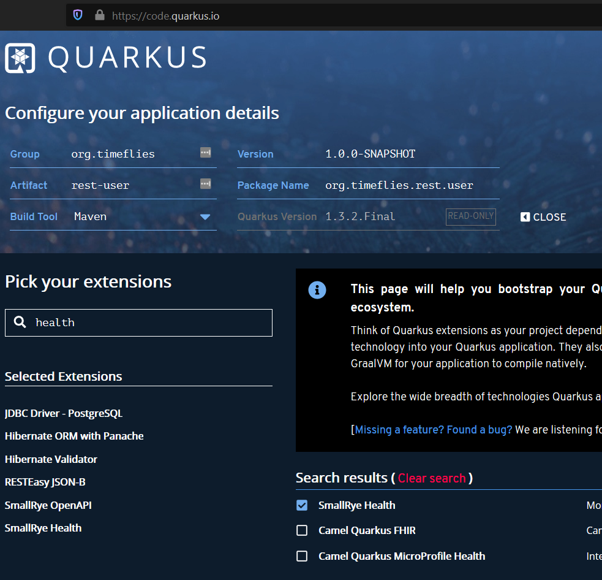
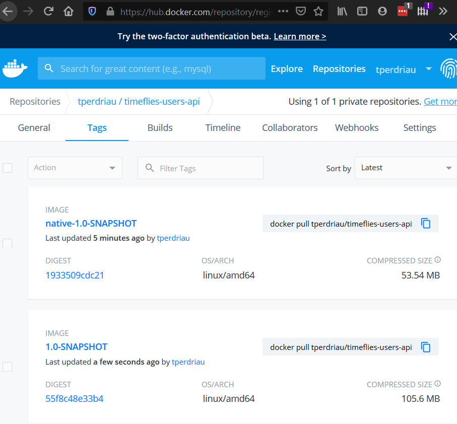

# rest-user : Micro service managing User Profile

This project uses [Quarkus](https://quarkus.io/)

## Quarkus Extensions
- jdbc-postgresql : PostgreSQL database connector
- hibernate-orm-panache : Define your persistent model in Hibernate ORM with Panache
- hibernate-validator : Validate your persistent model
- resteasy-jsonb : JSON-B serialization support for RESTEasy
- openapi : Document your REST APIs with OpenAPI - comes with Swagger UI
- health : Monitor service health
- metrics : Extract metrics out of your services
- container-image-jib : building  (and pushing) container images really fast and small (when it comes to pushing)

(!) Kotlin extension is excluded for the moment because of issues with Panache extension [quarkus #8333](https://github.com/quarkusio/quarkus/pull/8333) & [quarkus #4394](https://github.com/quarkusio/quarkus/issues/4394) 

## Bootstrapping the User REST Endpoint
Created with maven archetype template:
`````shell script
mvn io.quarkus:quarkus-maven-plugin:1.3.2.Final:create \
    -DprojectGroupId=org.timeflies \
    -DprojectArtifactId=rest-user \
    -DclassName="org.timeflies.users.UserResource" \
    -Dpath="api/users" \
    -Dextensions="jdbc-postgresql,hibernate-orm-panache,hibernate-validator,resteasy-jsonb,openapi,health,metrics,container-image-jib"
`````
Or can be imported thanks to [code.quarkus.oi](https://code.quarkus.oi)


## Directory Structure

The Maven archetype generates the following rest-user sub-directory:
- the Maven structure with a pom.xml
- an org.timeflies.users.UserResource resource exposed on /api/users
- an associated unit test UserResourceTest
- the landing page index.html that is accessible on http://localhost:8080 after starting the application
- example Dockerfile files for both native and jvm modes in src/main/docker. Would be replaced by jib later
- the application.properties configuration file

## Running the application in dev mode

You can run your application in dev mode that enables live coding using:
```
./mvnw quarkus:dev
```
Then check that the endpoint returns hello as expected:
````
$ curl http://localhost:8083/api/users
hello
````
Alternatively, you can open http://localhost:8083/api/users in your browser

## Transactions and ORM
   
The User API’s role is to allow CRUD operations on timeflies users. In this module we will create a User entity and persist/update/delete/retrieve it from a Postgres database in a transactional way.
You should already have installed the infrastructure into the infrastructure directory. Now, just execute `docker-compose -f docker-compose.yaml up -d`. You should see a few logs going on and then all the containers get started.
[Infra more info](../infrastructure/README.md)

### User Entity
To define a Panache entity, simply extend PanacheEntity, annotate it with @Entity and add your columns as public fields (no need to have getters and setters)
Notice that you can put all your JPA column annotations and Bean Validation constraint annotations on the public fields.

#### Operations
thanks to panache, here are the most common operations:
````java
// creating a user
Users user = new Users();
user.userName = "Superman";
user.status = "plop";

// persist it
user.persist();

// getting a list of all Users entities
List<Users> users = Users.listAll();

// finding a specific user by ID
user = Users.findById(id);

// counting all Users
long countAll = Users.count();
````

### hibernate config
Quarkus development mode is really useful for applications that mix front end or services and database access. We use quarkus.hibernate-orm.database.generation=drop-and-create in conjunction with import.sql so every change to your app and in particular to your entities, the database schema will be properly recreated and your data (stored in import.sql) will be used to repopulate it from scratch. This is best to perfectly control your environment and works magic with Quarkus live reload mode: your entity changes or any change to your import.sql is immediately picked up and the schema updated without restarting the application!

For that, make sure to have the following configuration in your application.properties (located in src/main/resources):
```` properties
quarkus.hibernate-orm.database.generation=drop-and-create
quarkus.hibernate-orm.log.sql=true
````
main way of obtaining connections to a database is to use a datasource. In Quarkus, the out of the box datasource and connection pooling implementation is Agroal
````properties
quarkus.datasource.url=jdbc:postgresql://localhost:5432/users_database
quarkus.datasource.driver=org.postgresql.Driver
quarkus.datasource.username=martine
quarkus.datasource.password=martine
quarkus.datasource.max-size=8
quarkus.datasource.min-size=2
````
### Transactional Service 

To manipulate the Users entity we will develop a transactional UsersService class. The idea is to wrap methods modifying the database (e.g. entity.persist()) within a transaction. Marking a CDI bean method @Transactional will do that for you and make that method a transaction boundary.

@Transactional can be used to control transaction boundaries on any CDI bean at the method level or at the class level to ensure every method is transactional. You can control whether and how the transaction is started with parameters on @Transactional:
- `@Transactional(REQUIRED)` (default): starts a transaction if none was started, stays with the existing one otherwise.
- `@Transactional(REQUIRES_NEW)`: starts a transaction if none was started ; if an existing one was started, suspends it and starts a new one for the boundary of that method.
- `@Transactional(MANDATORY)`: fails if no transaction was started ; works within the existing transaction otherwise.
- `@Transactional(SUPPORTS)`: if a transaction was started, joins it ; otherwise works with no transaction.
- `@Transactional(NOT_SUPPORTED)`: if a transaction was started, suspends it and works with no transaction for the boundary of the method ; otherwise works with no transaction.
- `@Transactional(NEVER)`: if a transaction was started, raises an exception ; otherwise works with no transaction.
Notice that both methods that persist and update a user, pass a Users object as a parameter. Thanks to the Bean Validation’s @Valid annotation, the Users object will be checked to see if it’s valid or not. It it’s not, the transaction will be rollback-ed.

## Testing Application
To test the Resource endpoint, we will be using a QuarkusTestResource that will fire a Postgres database and then test CRUD operations. The QuarkusTestResource is a test extension that can configure the environment before running the application. In our context, we will be using TestContainers to start our database.

For that we will install the TestContainers dependency in our pom.xml as well as some extra test dependencies:
````xml
<dependency>
    <groupId>org.testcontainers</groupId>
    <artifactId>junit-jupiter</artifactId>
    <version>1.13.0</version>
</dependency>
<dependency>
    <groupId>org.testcontainers</groupId>
    <artifactId>postgresql</artifactId>
    <version>1.13.0</version>
</dependency>
<dependency>
    <groupId>com.fasterxml.jackson.core</groupId>
    <artifactId>jackson-databind</artifactId>
    <scope>test</scope>
</dependency>
````
A [DatabaseResource test class](./src/test/java/org/timeflies/users/DatabaseResource.java) starts the database before the application, and set the quarkus.datasource.url system property to indicate to the application where is the test database. Note that the database would use a random port.


Notice also the `@QuarkusTestResource(DatabaseResource.class)`. It is how the QuarkusTestResource are attached to a test class.

With this code written, execute the test using `./mvnw test`. The test should pass.

## OpenAPI
Now, you curl http://localhost:8083/openapi endpoint
The MicroProfile OpenAPI has a set of annotations to customize each REST endpoint method so the OpenAPI contract is richer and clearer for consumers:
- `@Operation`: Describes a single API operation on a path.
- `@APIResponse`: Corresponds to the OpenAPI Response model object which describes a single response from an API Operation
- `@Parameter`: The name of the parameter.
- `@RequestBody`: A brief description of the request body.

[OpenApi Generator](https://openapi-generator.tech/docs/generators) (for example) propose to generate clients from open api specs in lots of languages

## Swagger UI 
When building APIs, developers want to test them quickly. Swagger UI is a great tool permitting to visualize and interact with APIs. The UI is automatically generated from your OpenAPI specification. The Quarkus smallrye-openapi extension comes with a swagger-ui extension embedding a properly configured Swagger UI page. By default, Swagger UI is accessible at /swagger-ui. So, once your application is started, you can go to http://localhost:8083/swagger-ui and play with API.

## Observability
### Health check
Quarkus applications can utilize the MicroProfile Health specification through the SmallRye Health extension. The MicroProfile Health allows applications to provide information about their state to external viewers which is typically useful in cloud environments where automated processes must be able to determine whether the application should be discarded or restarted

#### Running the Default Health Check

Importing the `smallrye-health` extension directly exposes three REST endpoints:
- [/health/live](http://localhost:8083/health/live) - The application is up and running.
- [/health/ready](http://localhost:8083/health/ready) - The application is ready to serve requests.
- [/health](http://localhost:8083/health) - Accumulating all health check procedures in the application.

All of the health REST endpoints return a simple JSON object with two fields:
- `status` — the overall result of all the health check procedures
- `checks` — an array of individual checks

The general status of the health check is computed as a logical AND of all the declared health check procedures. The checks array is empty by default but can be completed by custom health checks
- Custom Ready HealthCheck : [DatabaseConnectionHealthCheck](./src/main/java/org/timeflies/users/health/DatabaseConnectionHealthCheck.java)
- Custom Liveness Healthcheck : [PingUsersResourceHealthCheck](./src/main/java/org/timeflies/users/health/PingUsersResourceHealthCheck.java) 

### Metrics
MicroProfile Metrics allows applications to gather various metrics and statistics that provide insights into what is happening inside the application. The metrics can be read remotely using JSON format or the OpenMetrics format, so that they can be processed by additional tools such as Prometheus, and stored for analysis and visualisation
Adding Metrics to UsersResource:
We want now to measure all methods of all our REST resources. For that, we need a few annotations to make sure that our desired metrics are calculated over time and can be exported for manual analysis or processing by additional tooling. The metrics that we will gather are these:
- countGetXXX: A counter which is increased by one each time the user gets the XXX method.
- timeGetXXX: This is a timer, therefore a compound metric that benchmarks how much time the request take of the XXX method
````java
@Counted(name = "countGetRandomUser", description = "Counts how many times the getRandom method has been invoked")
@Timed(name = "timeGetRandomUser", description = "Times how long it takes to invoke the getRandom method", unit = MetricUnits.MILLISECONDS)
````

To view the metrics, execute 
````shell script
$ curl -H "Accept: application/json" http://localhost:8083/metrics/application
````

## Packaging and running the application

The application can be packaged using `./mvnw package`.
It produces the `rest-user-1.0-SNAPSHOT-runner.jar` file in the `/target` directory.
Be aware that it’s not an _über-jar_ as the dependencies are copied into the `target/lib` directory.

The application is now runnable using `java -jar target/rest-user-1.0-SNAPSHOT-runner.jar`.

### Build a container image and push to registry
[Docker Hub timeflies Users API](https://hub.docker.com/repository/docker/tperdriau/timeflies-users-api)

2 images should be available one JVM classic and a Native
#### Running container in docker engine 
Targeted container execution is kubernetes (not implemented yet)
````shell script
$ docker run --rm --name tfusers -p 8083:8083 tfusers tperdriau/timeflies-users-api:1.0-SNAPSHOT
# In previous case the container would not reach the database
$ docker run --rm --name tfusers --net="host" tperdriau/timeflies-users-api:1.0-SNAPSHOT
# In this case, it should join the dev database but it s unesecured
````
To remove container:
````shell script
$ docker run kill tfusers
# Check containers
$ docker ps
$ docker stats
````
(!) need to create a network with a view container will join postgresql database. 
### Creating a native executable

You can create a native executable using: `./mvnw package -Pnative`.

Or, if you don't have GraalVM installed, you can run the native executable build in a container using: `./mvnw package -Pnative -Dquarkus.native.container-build=true`.

You can then execute your native executable with: `./target/rest-user-1.0-SNAPSHOT-runner`

If you want to learn more about building native executables, please consult https://quarkus.io/guides/building-native-image.

### Container Images
The extension quarkus-container-image-jib is powered by Jib for performing container image builds. The major benefit of using Jib with Quarkus is that all the dependencies (everything found under target/lib) are cached in a different layer than the actual application making rebuilds really fast and small (when it comes to pushing). Another important benefit of using this extension is that it provides the ability to create a container image without having to have any dedicated client side tooling (like Docker) or running daemon processes (like the Docker daemon) when all that is needed is the ability to push to a container image registry.

In situations where all that is needed to build a container image and no push to a registry is necessary (essentially by having set `quarkus.container-image.build=true` and left `quarkus.container-image.push` unset - it defaults to false), then this extension creates a container image and registers it with the Docker daemon. This means that although Docker isn’t used to build the image, it is nevertheless necessary. Also note that using this mode, the built container image will show up when executing docker images. 
#### Building

To build a container image for your project, `quarkus.container-image.build=true` needs to be set using any of the ways that Quarkus supports.
````shell script
mvnw clean package -Dquarkus.container-image.build=true
````
For native:
````shell script
mvnw clean package -Pnative -Dquarkus.native.container-build=true 
````
#### Pushing

To push a container image for your project, `quarkus.container-image.push=true` needs to be set using any of the ways that Quarkus supports.
````shell script
mvnw clean package  -Dquarkus.container-build=true -Dquarkus.container-image.push=true
````
For native:
````shell script
mvnw clean package -Pnative -Dquarkus.native.container-build=true -Dquarkus.container-image.push=true -Dquarkus.container-image.tag=native-${quarkus.application.version:latest}
````
If no registry is set (using `quarkus.container-image.registry`) then [docker.io](https://hub.docker.com/) will be used as the default.

 